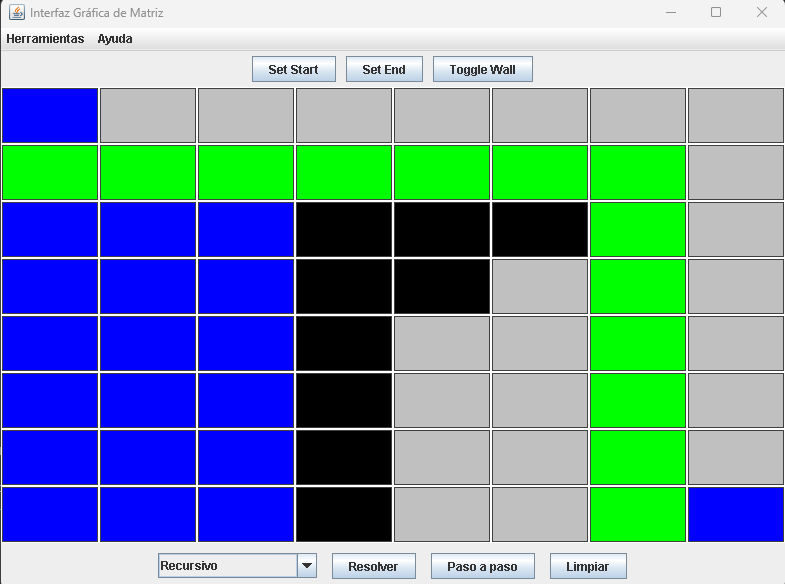
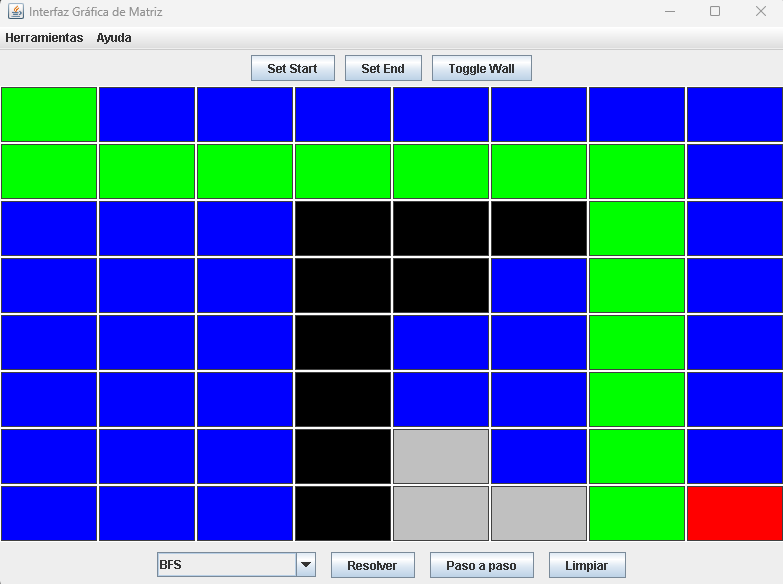

# 🧠 Resolución de Laberintos con Algoritmos de Búsqueda

<table>
  <tr>
    <td></td>
    <td>
      <h1>Universidad Politécnica Salesiana</h1>
    </td>
  </tr>
</table>

## **Materia:** Estructura de Datos  
## **Autores:**  
- Jaime Ismael Loja Tenesaca – `jlojat2@est.ups.edu.ec`  
- Guillermo Daniel Cajas Ortega – `gcajaso@est.ups.edu.ec`  
- Pablo Esteban Escandón Lema – `pescandonl@est.ups.edu.ec`  
- Kevin Andrés Paladines Toledo – `kpaladinest@est.ups.edu.ec`

---

## 📌 Descripción del Problema

El proyecto tiene como objetivo resolver laberintos de forma automática utilizando diversos algoritmos de búsqueda. Para ello, se proporciona una interfaz gráfica que permite al usuario diseñar el laberinto, establecer el punto de inicio y fin, y seleccionar el algoritmo a utilizar.

Este entorno permite observar el recorrido de cada algoritmo, su eficiencia y el camino final que logra trazar desde el inicio hasta el objetivo.


---

## 💡 Propuesta de Solución

Se implementó un sistema basado en el patrón Modelo-Vista-Controlador (MVC), en lenguaje Java, con una interfaz gráfica desarrollada en Swing. Se desarrollaron e integraron diversos algoritmos de búsqueda para la resolución de laberintos, cada uno con su propia estrategia de exploración:

- Recursivo con 2 direcciones

- Recursivo con 4 direcciones

- BFS (Breadth-First Search)

- DFS (Depth-First Search)

- Recursivo 4 direcciones con backtraking

#### El sistema permite además realizar la visualización paso a paso del recorrido y obtener estadísticas como tiempo y número de celdas exploradas.
---
### 📚 Marco Teórico

- **DFS (Depth-First Search):** Explora en profundidad un camino hasta llegar al final o atascarse, retrocediendo si es necesario (pila). Puede no encontrar la solución óptima, pero es fácil de implementar.  
- **BFS (Breadth-First Search):** Explora por niveles desde el punto de inicio. Garantiza encontrar el camino más corto, pero consume más memoria (cola).  
- **Backtracking Recursivo:** Prueba todas las posibles rutas utilizando retroceso. Guarda el camino y retrocede si se encuentra con un obstáculo o una ruta peor.  
- **Recursivo simple (mínimo):** Intenta ir solo hacia abajo o hacia la derecha, lo que reduce la complejidad, pero no siempre encuentra una solución si el camino está bloqueado.

---

### ⚙️ Tecnologías Utilizadas

- **Lenguaje:** Java  
- **Interfaz gráfica:** Swing  
- **Patrón de diseño:** Modelo-Vista-Controlador (MVC)  
- **Animación de recorrido:** `Consumer<Cell>` para callback visual  
- **Programación orientada a objetos**

---

### 📐 Diagrama UML (simplificado)
```java
src/
│
├── controllers/
│   ├── MaseSolverRecursivo.java  // Búsqueda recursiva simple (2 direcciones)
│   ├── MaseSolverRecursivoCompleto.java // Backtracking completo (4 direcciones)
│   ├── MazeSolver.java // Búsqueda en anchura con cola
│   ├── MazeSolverBFS.java // Búsqueda en anchura con cola
│   ├── MazeSolverDFS.java  // Búsqueda en profundidad con pila
│   └── MazeSolverRecursivoBT.java // Backtracking con poda optimizada
│
├── models/
│   ├── Cell.java // Representa posición en el laberinto
│   ├── MazeResult.java  // Resultado de la búsqueda (camino o error)
│   └── ResultadosAlgoritmos.java  // Resultado conjunto de todos los algoritmos
│
└── view/
    ├── MatrixUI.java  // Visualización y control de la interfaz
    └── App.java  // Punto de entrada para ejecutar la aplicación

```
---

### 🖼️ Capturas de la Interfaz

#### 🔸 Ejemplo 1 – Algoritmo: Recursivo 2 direcciones 

#### 🔸 Ejemplo 2 – Algoritmo: BFS (Breadth-First Search)  

---

### 💻 Código Comentado – Ejemplo: BFS

```java
@Override
public MazeResult getPath(boolean[][] grid, Cell start, Cell end, Consumer<Cell> callback) {
    int rows = grid.length;
    int cols = grid[0].length;
    boolean[][] visited = new boolean[rows][cols];
    Map<Cell, Cell> parent = new HashMap<>();

    Queue<Cell> queue = new LinkedList<>();
    queue.add(start);
    visited[start.getRow()][start.getCol()] = true;

    // Direcciones: abajo, arriba, derecha, izquierda
    int[][] directions = {{1, 0}, {-1, 0}, {0, 1}, {0, -1}};

    while (!queue.isEmpty()) {
        Cell current = queue.poll();

        // Visualizar celda explorada en UI
        if (callback != null && uiGrid != null) {
            callback.accept(uiGrid[current.getRow()][current.getCol()]);
            try {
                Thread.sleep(30); // Delay para visualizar recorrido
            } catch (InterruptedException e) {
                Thread.currentThread().interrupt();
            }
        }

        // Si se llegó al final
        if (current.equals(end)) {
            List<Cell> path = buildPath(parent, end);
            return new MazeResult(path, null);
        }

        // Explorar vecinos
        for (int[] dir : directions) {
            int newRow = current.getRow() + dir[0];
            int newCol = current.getCol() + dir[1];

            // Validar que esté dentro de los límites y no visitado
            if (newRow >= 0 && newRow < rows && newCol >= 0 && newCol < cols &&
                grid[newRow][newCol] && !visited[newRow][newCol]) {

                Cell neighbor = new Cell(newRow, newCol);
                queue.add(neighbor);
                visited[newRow][newCol] = true;
                parent.put(neighbor, current);
            }
        }
    }

    return new MazeResult(null, "No se encontró un camino");
}
 
 ```
---
## 📝 Conclusiones
#### Daniel Cajas:
Este proyecto me brindó una oportunidad valiosa para profundizar en el funcionamiento práctico de los algoritmos de búsqueda, al aplicarlos en una interfaz visual interactiva. Implementar métodos como BFS, DFS y búsquedas recursivas me permitió entender no solo sus diferencias conceptuales, sino también cómo se comportan en escenarios reales. La experiencia con Java y Swing reforzó mis habilidades en programación orientada a objetos y en estructurar código mediante el patrón MVC, mejorando la claridad y mantenibilidad del proyecto. La animación del recorrido y la retroalimentación visual facilitaron la comprensión teórica y la conexión con la práctica.

Además, al medir el tiempo y las celdas exploradas por cada algoritmo, pude analizar su eficiencia, lo que abre puertas para aplicar estos conocimientos en futuros desarrollos que requieran optimización o procesamiento de grafos.

#### Jaime Loja:
Se desarrolló y afinó una interfaz gráfica en Java que permite visualizar la solución de laberintos usando diferentes algoritmos. Se integraron correctamente las implementaciones de BFS y búsqueda recursiva para ofrecer varias opciones al usuario, con un sistema de menús y botones que facilitan la interacción, incluyendo la opción de avanzar paso a paso.

Se incorporaron elementos visuales que resaltan las celdas exploradas y el camino final, haciendo la experiencia más intuitiva. Además, se aseguró la compatibilidad entre las clases mediante el uso uniforme del modelo Cell. El sistema está diseñado para incorporar fácilmente nuevos algoritmos, como DFS o backtracking, en futuras versiones.

En resumen, el usuario puede personalizar el laberinto, seleccionar los puntos clave, elegir el algoritmo, y observar claramente el proceso de búsqueda completo o incremental.
#### Kevin Paladines:
Este proyecto contribuyó a mi formación al permitirme comparar varias técnicas de búsqueda para un mismo problema, comprendiendo las ventajas y limitaciones de cada una. Esto me ayudó a valorar la importancia de seleccionar el algoritmo más adecuado según el contexto y necesidades del usuario. La adopción del patrón MVC facilitó una mejor organización del código y una interfaz gráfica más clara y funcional, lo que a su vez mejoró la experiencia de desarrollo y uso.


#### Pablo Escandón:
La realización de este proyecto me ayudó a comprender de manera más práctica el funcionamiento de los algoritmos de búsqueda en laberintos. Al implementar y probar diferentes métodos, pude observar las variaciones en el rendimiento y la forma en que cada uno encuentra el camino. Trabajar con la interfaz gráfica en Java me permitió mejorar mis habilidades de programación, especialmente en el manejo del patrón MVC y la interacción entre la lógica del programa y la visualización del proceso.

#### Este aprendizaje no solo fortalece mis bases en estructuras de datos, sino que también me motiva a seguir explorando técnicas más avanzadas para resolver problemas de optimización y búsqueda de rutas.
--- 

## 🧭 Recomendaciones y Aplicaciones Futuras

- Se podría integrar una **métrica de rendimiento** para contar pasos, tiempo y memoria utilizada por cada algoritmo.
- Ampliar los algoritmos con **A\*** o **Dijkstra** para resolver laberintos más complejos.
- Incorporar **generación automática de laberintos aleatorios**.
- Permitir **exportar el camino resultante** como imagen o archivo para documentación o análisis.
- Implementar una **versión web en JavaScript (Canvas)** para mejorar la accesibilidad y portabilidad de la herramienta.

